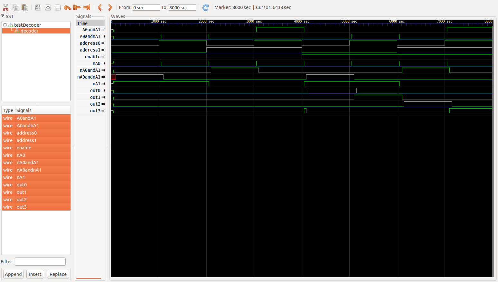
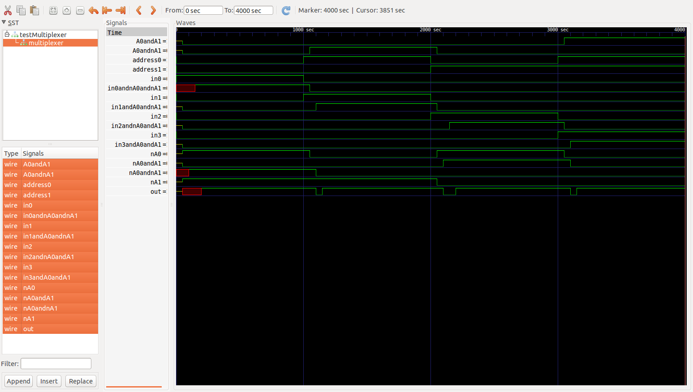
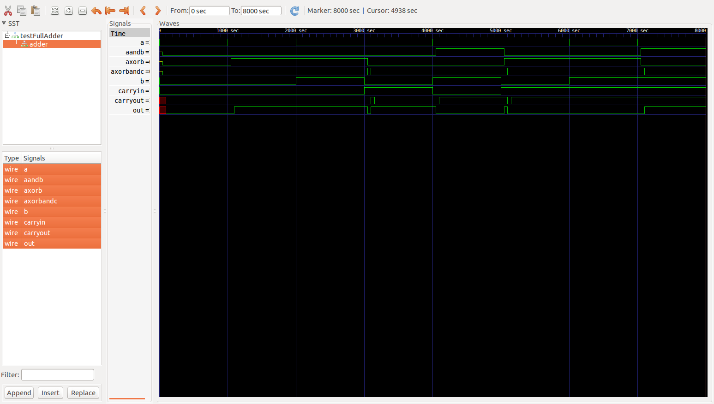

#Results
##Decoder

###Test Bench
| En| A0| A1| O0| O1| O2| O3| Expected Output |
|:-:|:-:|:-:|:-:|:-:|:-:|:-:|:---------------:|
|  0|  0|  0|  0|  0|  0|  0|  All false      |
|  0|  1|  0|  0|  0|  0|  0|  All false      |
|  0|  0|  1|  0|  0|  0|  0|  All false      |
|  0|  1|  1|  0|  0|  0|  0|  All false      |
|  1|  0|  0|  1|  0|  0|  0|  O0 Only        |
|  1|  1|  0|  0|  1|  0|  0|  O1 Only        |
|  1|  0|  1|  0|  0|  1|  0|  O2 Only        |
|  1|  1|  1|  0|  0|  0|  1|  O3 Only        |

###Waveforms

##Multiplexer

###Test Bench (Simplified)
| A0| A1| I0| I1| I2| I3|  O|Expected Output|
|:-:|:-:|:-:|:-:|:-:|:-:|:-:|:-------------:|
| 0 | 0 | 1 | 0 | 0 | 0 | 1 |    1          |
| 1 | 0 | 0 | 1 | 0 | 0 | 1 |    1          |
| 0 | 1 | 0 | 0 | 1 | 0 | 1 |    1          |
| 1 | 1 | 0 | 0 | 0 | 1 | 1 |    1          |

###Waveforms

##Adder

###Test Bench
| A | B | Carryin| Sum| Carryout| Expected Sum | Expected Carryout|
|:-:|:-:|:------:|:--:|:-------:|:------------:|:----------------:|
| 0 | 0 |   0    | 0  |    0    |  0           |  0               |
| 1 | 0 |   0    | 1  |    0    |  1           |  0               |
| 0 | 1 |   0    | 1  |    0    |  1           |  0               |
| 0 | 0 |   1    | 1  |    0    |  1           |  0               |
| 1 | 1 |   0    | 0  |    1    |  0           |  1               |
| 1 | 0 |   1    | 0  |    1    |  0           |  1               |
| 0 | 1 |   1    | 0  |    1    |  0           |  1               |
| 1 | 1 |   1    | 1  |    1    |  1           |  1               |

###Waveforms

