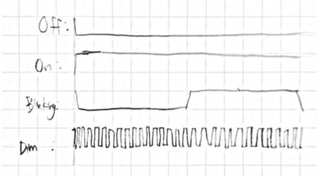
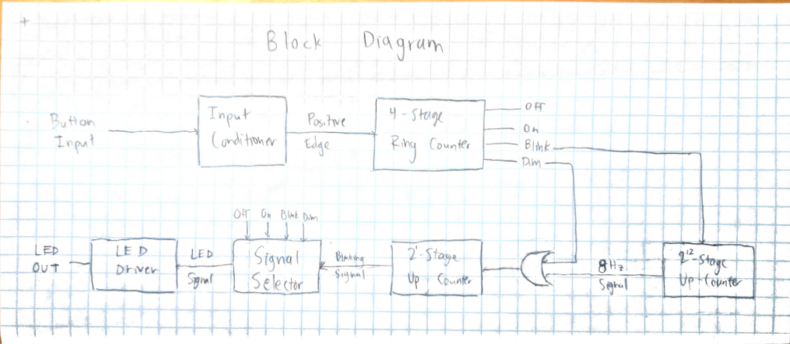
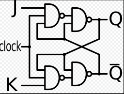
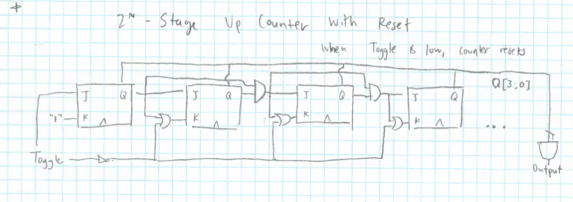
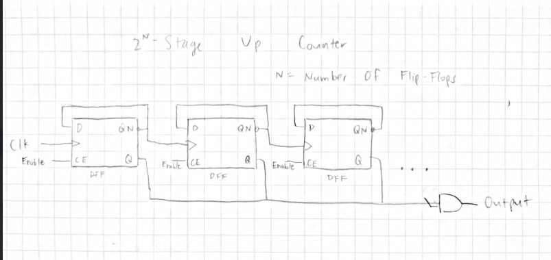
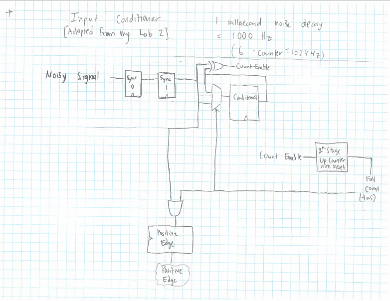
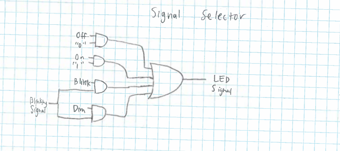

# Bicycle Light Schematic
## Comp Arch Fall 2015 Midterm, Kai Levy

### Specifications
  The system runs on a 32768hz clock.

#### Inputs and Outputs
 - The button on the bike light is the only input
 - The light from the LED is the only Outputs

#### Operational Modes
  1. Off: The LED is not light
  2. On: The LED is brightly and continuously light
  3. Blinking: The LED blinks brightly at a frequency of 4hz
  4. Dim: The LED is lit at half-brightness, by blinking with a 50% duty cycle (a frequency of 16384hz), faster than the human eye can perceive

  The below figure shows the output for each of the four modes. It should be noted that the 'Dim' mode is not drawn to scale with the rest, and will in reality be alternating 8192 times in the given timescale.

  

### Block Diagram
  

### Detailed Schematics
  Enclosed are more detailed schematics for each block in the block diagram.
  A few components (N Stage System Clock, Ring Counter, LED Driver) are specified in the included pdf `Midterm.pdf`, and will not be repeated here.

#### JK Flip Flop
  This design was taken from this [article](https://en.wikipedia.org/wiki/Flip-flop_(electronics)#JK_flip-flop)

##### Specifications
  This flip flop toggles when both J and K are high, and holds when both are low. If J is low and K is high, it 'resets' (Qnext = low), if J is high and K is low, it 'sets' (Qnext = high).

##### Inputs and Outputs
  - J and K are inputs for manipulating the state, and Clk is the clock input
  - Qnext is described by the expression `J~Q + ~KQ` and is set on rising edge of the clock. ~Q is an additional output, the Boolean complement of Q.

##### Schematic
  

##### Cost Analysis
| Subcomponent                     | Cost per | # Used | Total  |
|----------------------------------|----------|--------|--------|
| 2 Input NAND                     | 2        | 2      | 4      |
| 3 Input NAND                     | 3        | 2      | 6      |
| Total                            |          |        | 10     |

#### 2n Stage Up Counter

##### Specifications
  This uses a series of JK flip flops to increment a counter on the rising clock while toggle is high. It uses N flip flops, and can count up to 2n. Upon counting to completion, it outputs high, and otherwise outputs low. When toggle is low, it resets the count.

##### Inputs and Outputs
  - Toggle is the main input, and while it is high, the counter counts. While low, it resets. It also receives the clock.
  - The only output is high upon completing the count (by AND-ing the outputs of each flip flop together). Otherwise, it is low.

##### Schematic
  

##### Cost Analysis
| Subcomponent  | Cost per | # Used       | Total    |
|---------------|----------|--------------|----------|
| JK Flip Flop  | 10       | N            | 10N      |
| Inverter      | 1        | 1 (if N > 1) | 1        |
| 2 Input OR    | 3        | N-1          | 3(N - 1) |
| 2 Input AND   | 3        | N-2          | 3(N - 2) |
| N Input AND   | N + 1    | 1 (if N > 1) | N + 1    |
| Total (N = 1) |          |              | 10       |
| Total (N > 1) |          |              | 17N - 7  |

<!-- #### 2n Stage Up Counter Without Reset
##### Specifications
  This uses a series of D flip flops to increment a counter on the rising clock, while enabled. It uses N flip flops, and can count up to 2n. Upon counting to completion, it outputs high, and otherwise outputs low.

##### Inputs and Outputs
  - While enable is high, the counter counts. If enable is low, it holds state. It also receives the clock.
  - The only output is high upon completing the count (by AND-ing the outputs of each flip flop together). Otherwise, it is low.

##### Schematic
  

##### Cost Analysis
| Subcomponent  | Cost per | # Used       | Total    |
|---------------|----------|--------------|----------|
|  D Flip Flop with Enable  | 20       | N            | 20N      |
| N Input AND   | N + 1 | 1 (if N > 1) | N + 1|
| Total (N = 1) |          |           |           20|
| Total (N > 1) |           |           |           21N + 1| -->

#### Input Conditioner
  This design is adapted from my own [Lab 2 Input Conditioner](https://github.com/nshlapo/CompArchLab2/blob/master/pics/circuit.jpg).

##### Specifications
  The purpose of this part is to smoothen and de-bounce the noisy input from the button, and to pass along a signal when it receives a definitive button press. It does this by passing the noisy signal into two D-flip-flops. While the second DFF (Sync 1) is not the same as the conditioned input (Conditioned), it increments a 26 stage resettable up counter, which takes 1024hz = 0.97 ms to complete a count. If the count completes, it sends Sync 1 into Conditioned, and if the new input is a high signal, outputs a Positive Edge for the system.

##### Inputs and Outputs
  - The only input is the noisy signal from the button
  - The only output is the positive edge signal which is high for one clock cycle when we are sure that the button has been pressed

##### Schematic
  

##### Cost Analysis
| Subcomponent                    | Cost per | # Used | Total |
|---------------------------------|----------|--------|-------|
| Pos Edge D Flip Flop            | 13       | 4      | 52    |
| 2 Input XOR                     | 3        | 1      | 3     |
| 2 Input MUX                     | 7        | 1      | 7     |
| 2 Input AND                     | 3        | 1      | 3     |
| 26 Stage Up Counter with Reset | 95  | 1   | 95    |
| Total                           |          |        | 160   |

#### Signal Selector

##### Specifications
  This part sends the appropriate signal to the LED Driver. To do this, it ANDS each state (from the 4-stage one-hot counter) with their respective signal frequency. The On with '1' (always on), the Off with '0' (always off), and the blink and dim with the blinking signal, which has a frequency determined by the earlier components (either 4hz if blinking or 16384hz if dimming).

##### Inputs and Outputs
  - This part receives each of the one-hot encoded signals, `OFF`, `ON`, `BLINK`, and `DIM`. It also receives the blinking signal from the up counter before it.
  - The output is the LED Signal which is send to the driver to be amplified and applied to the LED.

##### Schematic
  

##### Cost Analysis
| Subcomponent  | Cost per | # Used       | Total    |
|---------------|----------|--------------|----------|
| 2 Input AND   | 3        | 4            | 12       |
| 4 Input OR    | 5        | 1            | 5        |
| Total         |          |              | 17       |

### Total Cost Estimation
| Subcomponent          | Cost per | # Used | Total                        |
|-----------------------|----------|--------|------------------------------|
| Input Conditioner     | 160      | 1      | 160                          |
| 4 Stage Ring Counter  | 83       | 1      | 83                           |
| 212 Stage Up Counter | 197      | 1      | 197                          |
| 2 Input OR            | 3        | 1      | 3                            |
| 21 Stage Up Counter  | 10       | 1      | 10                           |
| Signal Selector       | 17       | 1      | 17                           |
| LED Driver            | 211      | 1      | 211                          |
| Total                 |          |        | 681 (470 without LED driver) |
